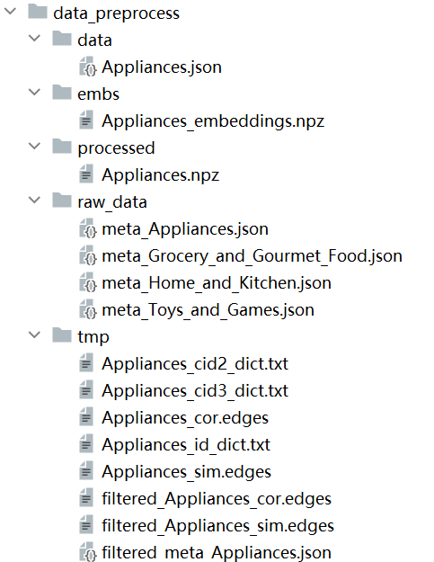

 # Similar or Related: Spectral-Based Item Relationship Mining with Graph Convolutional Network for Complementary Recommendation
 
This is the PyTorch implementation for **SR-Rec** proposed in the paper **Similar or Related: Spectral-Based Item Relationship Mining with Graph Convolutional Network for Complementary Recommendation**.

>  2024


## 2. Running environment

We develop our codes in the following environment:

- python==3.9.18
- numpy==1.24.3
- torch==1.13.0
- torch-cuda=11.7

## 3. Datasets

| Dataset      | Appliances   | Grocery | Home |
| ------------ |----------| ------  | -------------|
| Items        | 804      | 38,548  | 75,514       |
| Edges        | 8,290    | 642,884 | 776,766      |
| Avg. Degree  | 20.6     | 33.4    | 20.6         |

## 4. Data Preprocessing
way1:
- Download raw_data from https://nijianmo.github.io/amazon/index.html.
- Put the meta data file in <tt>./data_preprocess/raw_data/</tt>.
- Set the dataset name (i.e., <tt>$dataset</tt>) in run.sh, run preprocessing by 
    ```
    cd data_preprocess
    sh run.sh
    ```

way2:
- We provide the download method of [Google Cloud](https://drive.google.com/drive/folders/1kCx6WllSrI9KUVCdo2u2BoAmuSnlHYPm?usp=sharing) for the convenience of use, the link is xxx.


Taking the Appliances dataset as an example, the correspondence between files and folders is as follows



## 5. How to run the codes


```python9
 python run.py
```
